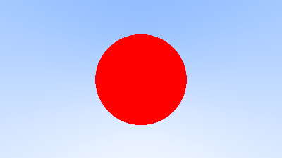

Ray tracing in one weekend in Rust
===


A Rust implementation of Peter Shirley's [Ray Tracing in One Weekend](https://raytracing.github.io/books/RayTracingInOneWeekend.html).

## How to run
```
cargo run --release
```
The program will emit an image file (`image.png`).
# Image outputs
Images showing the progression of the book, chapter by chapter.

## 2 Output an Image


## 4 Rays, a Simple Camera, and Background
 

## 5 Adding a sphere


## 6 Surface Normals and Multiple Objects

### 6.1 Shading with Surface Normals


### 6.7 Common Constants and Utility Functions


## 7 Antialiasing


*Before and after antialiasing*

## 8 Diffuse Materials

### 8.1 A Simple Diffuse Material


### 8.3 Using Gamma Correction for Accurate Color Intensity


### 8.4 Fixing Shadow Acne


## 9 Metal

### 9.5 A Scene with Metal Spheres


### 9.6 Fuzzy Reflection


## 10 Dielectrics

### 10.2 Snell's Law


### 10.3 Total Internal Reflection


### 10.5 Modeling a Hollow Glass Sphere


## 11 Positionable Camera

### 11.1 Camera Viewing Geometry


### 11.2 Positioning and Orienting the Camera


*A distant view*


*Zooming in*

## 12 Defocus Blur


*Spheres with depth-of-field*

## 13 A Final Render


*Final scene*